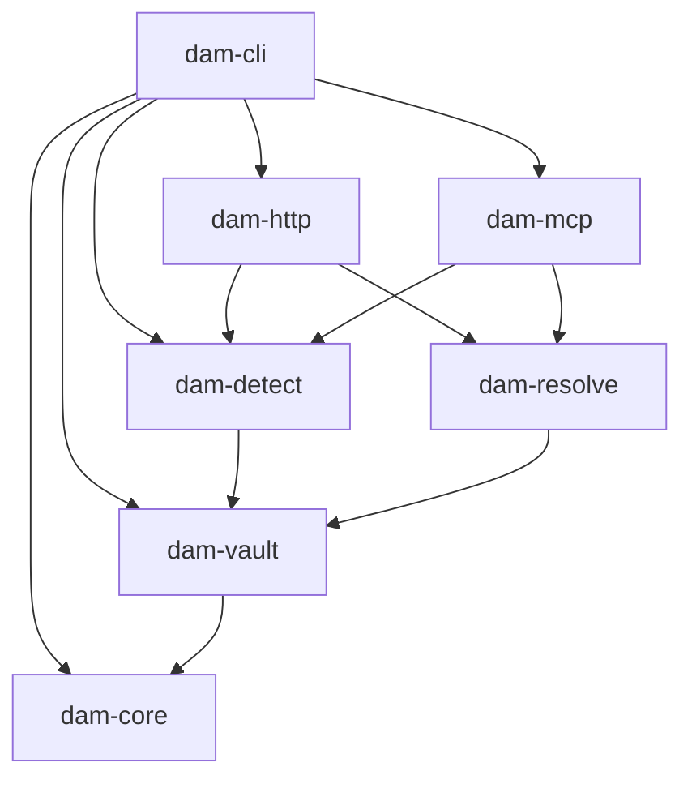
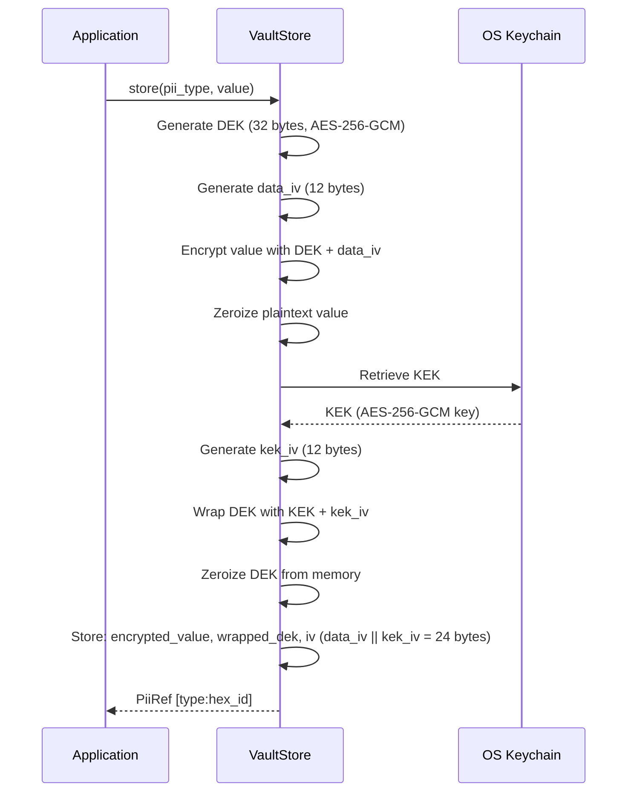
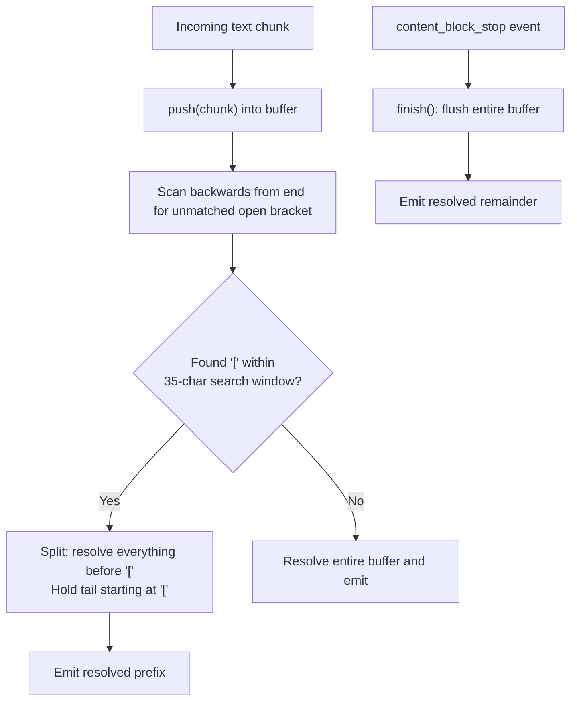

# Architecture

This document describes the internal architecture of DAM (Data Access Mediator), a PII firewall for AI agents. It covers the crate structure, encryption design, detection pipeline, consent model, audit chain, and streaming resolution.

---

## Table of Contents

- [Crate Dependency Graph](#crate-dependency-graph)
- [Envelope Encryption](#envelope-encryption)
- [Detection Pipeline](#detection-pipeline)
- [Consent Resolution](#consent-resolution)
- [Audit Hash Chain](#audit-hash-chain)
- [Streaming SSE Resolution](#streaming-sse-resolution)
- [Threat Model](#threat-model)

---

## Crate Dependency Graph

The workspace is organized into seven crates, each with a focused responsibility. `dam-cli` is the entry point and depends on everything else. `dam-core` is the leaf — it defines shared types, errors, and configuration.



| Crate | Responsibility |
|-------|---------------|
| **dam-core** | Types (`PiiType`, `PiiRef`), reference format, config schema, `DamError`/`DamResult<T>` |
| **dam-vault** | Encrypted local storage: SQLite + AES-256-GCM envelope encryption, deduplication |
| **dam-detect** | PII detection pipeline: regex stages, user rules, NER stub, cross-reference stub |
| **dam-resolve** | Outbound resolution with consent checks |
| **dam-mcp** | MCP server exposing 7 tools (`dam_scan`, `dam_resolve`, `dam_consent`, etc.) |
| **dam-http** | HTTP proxy mode, Anthropic API types, streaming SSE resolver |
| **dam-cli** | CLI binary (`dam` command): `dam serve`, `dam mcp`, `dam scan`, etc. |

---

## Envelope Encryption

Every PII value stored in the vault gets its own data encryption key (DEK). This limits the blast radius of a single compromised entry — one leaked DEK reveals one value, not the entire vault.

### Flow



### Key Details

- **DEK**: 32-byte random key generated via `rand::thread_rng().fill_bytes()`. Used once for a single entry, then zeroized from memory via the `zeroize` crate.
- **KEK**: Master key stored in the OS keychain (Windows DPAPI, macOS Keychain, or Linux libsecret). Never written to disk.
- **IV storage**: The 24-byte IV column stores `data_iv (12 bytes) || kek_iv (12 bytes)` concatenated.
- **Algorithm**: AES-256-GCM for both layers (data encryption and key wrapping).
- **Deduplication**: The same value + type combination is stored once. Subsequent stores return the existing reference.

### Why Per-Entry DEKs

A single KEK wrapping all data directly would mean one key compromise exposes everything. With envelope encryption, compromising a DEK exposes one entry. Compromising the KEK is equivalent, but the KEK lives in the OS keychain with hardware-backed protection — it is never serialized to the database.

---

## Detection Pipeline

The detection pipeline transforms raw text into redacted text with PII replaced by typed references. It operates in four stages, with normalization happening before regex matching.

### Data Flow

```mermaid
flowchart LR
    subgraph Input
        RAW[Raw text]
    end

    subgraph stage_regex["Stage 1: Regex"]
        NORM[Normalize] --> MATCH[Regex match] --> VALIDATE[Per-type validation]
    end

    subgraph stage_rules["Stage 2: User Rules"]
        CUSTOM[User-defined regex from config]
    end

    subgraph stage_ner["Stage 3: NER (stub)"]
        NER[Named entity recognition]
    end

    subgraph stage_xref["Stage 4: Cross-Reference (stub)"]
        XREF[Vault cross-reference lookup]
    end

    subgraph Post
        WHITELIST[Filter whitelisted terms]
        EXCLUDE[Filter excluded types]
        DEDUP[Deduplicate overlapping spans]
        STORE[Store in vault]
        REPLACE[Replace spans with refs]
    end

    RAW --> NORM
    VALIDATE --> CUSTOM
    CUSTOM --> NER
    NER --> XREF
    XREF --> WHITELIST --> EXCLUDE --> DEDUP --> STORE --> REPLACE
```



### Stage 1: Normalization

Before regex matching, the input text is normalized to defeat evasion techniques:

| Transformation | Example |
|---------------|---------|
| Strip zero-width characters (U+200B, U+200C, U+200D, U+FEFF, U+00AD) | `j​ohn@acme.com` (with ZWJ) becomes `john@acme.com` |
| Map Unicode dashes (U+2010 through U+2015, U+2212) to ASCII hyphen | `555–1234` becomes `555-1234` |
| NFKC normalization | Fullwidth `＠` becomes `@` |
| URL-decode | `john%40acme.com` becomes `john@acme.com` |
| Base64-decode segments (20+ chars) | Encoded PII in Base64 payloads is decoded and scanned |

All detection offsets reference the normalized text, not the original.

### Stage 1: Validation

After regex matching, each candidate is validated with a type-specific check:

| PII Type | Validator |
|----------|-----------|
| Credit card | Luhn checksum |
| IBAN | Mod 97 (ISO 7064) |
| SSN | Area code range check (rejects area >= 900, 000, 666) |
| IPv4 | Rejects private ranges (10.x, 172.16-31.x, 192.168.x), loopback, link-local, broadcast |
| NHS number | Mod 11 check digit (rejects all-zeros) |
| INSEE/NIR | Key validation (97 - (number mod 97)) |
| SWIFT/BIC | English-word filter (vowel heuristic + exclusion list for 8-char all-alpha strings) |

### Locale Organization

Detection patterns are organized by geographic locale:

- `global.rs` — Email, credit card, international phone, IPv4, date of birth, IBAN
- `us.rs` — SSN, US phone
- `ca.rs` — SIN, postal code
- `uk.rs` — NI number, NHS number, DVLA number
- `fr.rs` — INSEE/NIR
- `de.rs` — Personalausweis, Steuer-ID
- `eu.rs` — VAT number, SWIFT/BIC

Country-specific patterns go in their locale module. Universal patterns go in `global.rs`.

### Deduplication

When multiple detections overlap in the text (e.g., a phone number substring matching both a US phone and international phone pattern), the pipeline keeps only the detection with the highest confidence and discards the rest.

---

## Consent Resolution

All PII resolution is denied by default. A consumer must have an explicit consent rule granting access before any reference can be resolved.

### Matching Algorithm

Consent rules are checked in priority order. The first match wins:

```
1. Exact match      →  (ref_id, accessor, purpose)
2. Wildcard accessor →  (ref_id, "*",      purpose)
3. Wildcard purpose  →  (ref_id, accessor, "*")
4. Full wildcard     →  (ref_id, "*",      "*")
5. No match          →  DENIED
```

### Behavior

- If no rule matches, resolution is **denied**. This is the consent-by-default-denied principle.
- Expired rules (past their `expires_at` timestamp) are cleaned up during the check — they are deleted from the database and never match.
- Rules are stored in the same SQLite database as the vault, managed by `ConsentManager`.
- The `dam_consent` MCP tool and CLI command grant or revoke rules. The `dam_resolve` tool checks consent before returning any value.

---

## Audit Hash Chain

Every vault operation (scan, resolve, reveal, consent change) is recorded in a tamper-evident audit log. Entries are linked by a SHA-256 hash chain, similar in concept to a blockchain but without distributed consensus.

### Hash Computation

Each audit entry's hash is computed over the following fields, concatenated in order:

| Field | Encoding |
|-------|----------|
| `id` | i64, little-endian bytes |
| `ref_id` | UTF-8 string bytes |
| `accessor` | UTF-8 string bytes |
| `purpose` | UTF-8 string bytes |
| `action` | UTF-8 string bytes |
| `granted` | Single byte: `1` if granted, `0` if denied |
| `timestamp` | i64, little-endian bytes |
| `prev_hash` | Hex-encoded hash of the previous entry (empty for the first entry) |

The resulting SHA-256 digest is stored as a hex string.

### Chain Verification

`verify_chain()` walks all entries in ascending `id` order and checks:

1. **Modified rows**: Recomputes the expected hash from the entry's fields and its stored `prev_hash`. If the computed hash does not match the stored hash, the row was modified after creation.
2. **Deleted rows**: Each entry's `prev_hash` must equal the hash of the immediately preceding entry. A gap indicates a deleted row.
3. **Reordered rows**: Ordering by `id` must produce a consistent chain. Reordering breaks the `prev_hash` linkage.

---

## Streaming SSE Resolution

When DAM operates as an HTTP proxy (e.g., proxying Anthropic's Messages API), LLM responses arrive as Server-Sent Events (SSE) with text delivered in small chunks. References like `[email:a3f71bc9]` may be split across chunk boundaries. The streaming resolver handles this without buffering the entire response.

### Algorithm



### Key Details

- **Search window**: 35 characters from the end of the buffer. The longest possible reference is `[custom:aaaaaaaaaaaaaaaa]` at 25 characters, plus 10 characters of margin.
- **Per-block state**: `SseState` maintains a `HashMap<usize, StreamingResolver>` keyed by content block index. Each content block gets its own resolver instance.
- **SSE boundary detection**: The parser checks for both `\n\n` and `\r\n\r\n` as event terminators.
- **Early termination**: If the stream ends without a `content_block_stop` event (e.g., network error or missing terminator), both the raw SSE buffer and all resolver buffers are flushed to avoid truncating the response.
- **Resolution**: References in emitted text are resolved by looking up the vault. In proxy mode, resolution bypasses consent/audit because the user is viewing their own data in the response.

---

## Threat Model

### What DAM Protects Against

| Threat | Mitigation |
|--------|-----------|
| PII leaking into LLM context windows | Detection pipeline intercepts and replaces PII before it reaches the API |
| Unauthorized resolution of stored PII | Consent-by-default-denied: no resolution without an explicit consent rule |
| Audit log tampering | SHA-256 hash chain detects modified, deleted, or reordered rows |
| Single-entry compromise exposing all data | Envelope encryption: each entry has its own DEK |
| Evasion via Unicode tricks, encoding, or formatting | Normalization stage (zero-width stripping, NFKC, URL-decode, Base64-decode) |

### What DAM Does NOT Protect Against

| Threat | Reason |
|--------|--------|
| Compromised OS or local admin access | The KEK lives in the OS keychain, which is accessible to privileged local users |
| Malicious processes with same-user permissions | OS keychain access is per-user, not per-process |
| Prompt injection causing the LLM to ignore references | Mitigated (not prevented) by proxy mode — the LLM never sees real values regardless of instructions |
| Side-channel inference from reference patterns | Type tags (e.g., `email`, `ssn`) are visible, revealing that PII of that type exists in the text |
| Network attacks on the proxy | The proxy binds to localhost only and does not implement TLS (intended for local use) |

### Trust Boundaries

```
┌─────────────────────────────────────────────────────┐
│  TRUSTED: User's machine                            │
│                                                     │
│   Application  ───►  DAM Proxy  ───►  Vault         │
│                        │                             │
│                        │  PII stripped here           │
│                        ▼                             │
├─────────────────────────────────────────────────────┤
│  UNTRUSTED: Network / Cloud                         │
│                                                     │
│   Only typed references cross this boundary          │
│   e.g., [email:a3f71bc9], [ssn:b2c84d01]            │
│                                                     │
│   LLM Provider  ◄──  References only                │
└─────────────────────────────────────────────────────┘
```

The trust boundary is the network edge of the user's machine. DAM ensures that no PII value crosses this boundary. The LLM provider is treated as fully untrusted — it receives only type tags and opaque identifiers.
